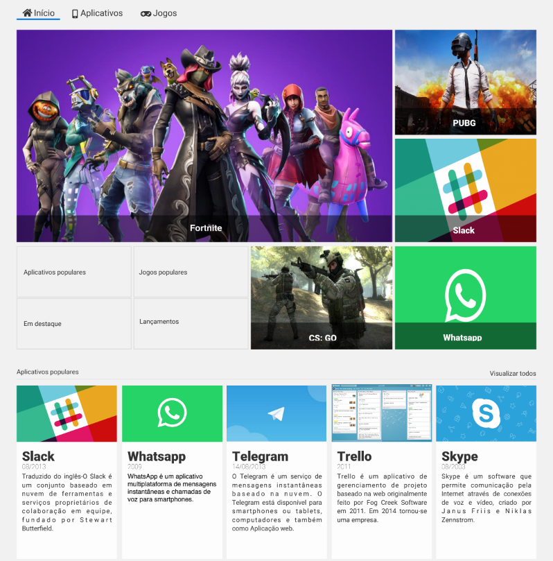

# Store Grid : Store de app - uso de grid

 

 

<h1>Descrição da pagina</h1>

<h4 align="center"> 
    :100:  Projeto concluido  :heavy_check_mark:
</h4>

 Modulo do programa One, aplicando grid na construção de uma pagina web.

## :bookmark_tabs: Proposta:

<li>- Simplificando a criação de layouts complexos;</li>
<li>- Posicionando elementos com mais facilidade;</li>
<li>- Utilizando grid para calcular e alinhar elementos;</li>
<li>- Criando templates com mais eficiência e simplicidade;</li>
<li>- Dizendo aos elementos onde eles devem se posicionar;</li>
<li>- Dizendo aos elementos onde eles devem começar e terminar.</li>

## 📁 Acesso a pagina

Link de acesso a pagina (pagina estética):

:link: <a href="https://amandaafernandes.github.io/Alura_Store-Grid/"> Store Grid</a> 

## :computer: Ferramentas e Tecnologias utilizadas:
<li>Javascript;</li> 
<li>HTML5;</li>
<li>CSS 3;</li>
<li>Git e Guithub.</li>
(trilha front end - Programa One de Alura + Oracle).
